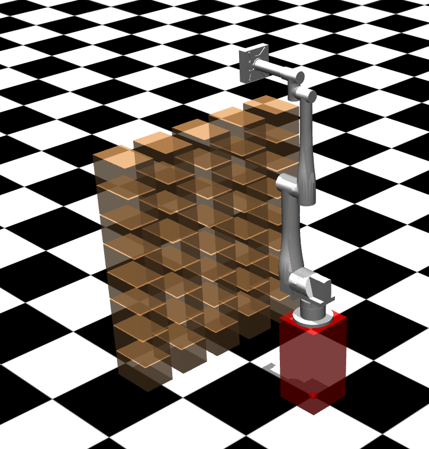
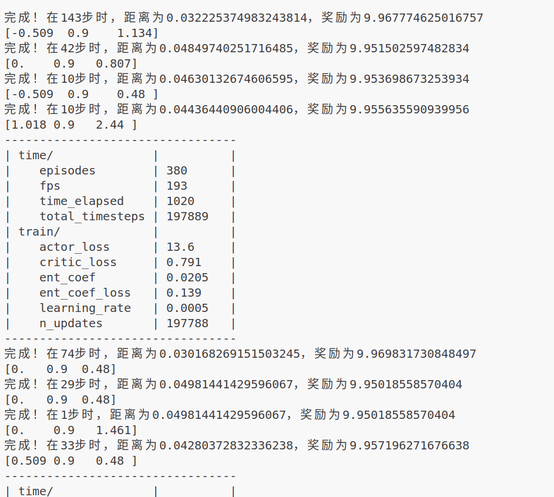

# 用自己的机械臂在mujoco里训练强化学习代码

## 背景说明
最近在学习机械臂强化学习路径规划，参考了知乎教程[《使用Stable-Baselines3训练Panda机械臂》](https://zhuanlan.zhihu.com/p/491909457)。由于原教程较老（使用stable baselines3+panda-gym），新版本变化了，我略做调整，记录写在[CSDN博客](https://blog.csdn.net/qq_63308550/article/details/146564663)。

上面这个教程用的是官方`PandaReach-v3`，环境封装较死（类似[FetchReach](https://robotics.farama.org/envs/fetch/reach/)），最终基于[aubo机械臂模型](https://github.com/AuboRobot/aubo_description)重新开发。

代码已开源至github


## 基础配置
```python
# 环境配置
ubuntu22.04
python=3.8
gymnasium==1.0.0
mujoco==3.2.3
stable_baselines3==2.4.1

# 机械臂模型
aubo_with_box.xml（含连杆/吸盘/托盘/箱子）
```


## 环境构建

### 1.1 动作空间
```python
# 最终采用笛卡尔空间位移控制
self.action_space = spaces.Box(
    low=-2, 
    high=2, 
    shape=(3,),  # x,y,z方向
    dtype=np.float32
)
```
- 实际位移量缩放0.05倍（单步移动≤1cm）
- 尝试方案：
  - 直接输出六个关节角度 ❌
  - 六个关节力矩控制 ❌

### 1.2 观测空间
包括当前pos，目标pos，相差位置，末端速度
```python
self.observation_space = spaces.Box(
    low=-np.inf,
    high=np.inf,
    shape=(12,),  # [current_pos(3), target_pos(3), rel_pos(3), velocity(3)]
    dtype=np.float32
)
```

### 1.3 环境重置

```python
# 机械臂回零位
self.data.qpos = np.zeros(self.model.nq)
mujoco.mj_forward(self.model, self.data)
```
然后设置新的目标，就是在前三排的箱子中任选一个箱子。
### 1.4 执行动作
预测后得到action，计算出target_pos，用逆运动学解算计算出解，这里逆运动学的代码不方便开源。但是可以用pd的方法找到拟合解，也在代码里，被注释的部分
```python
success = self._apply_ros_control(target_pos.copy())
# print(f"target_pos: {target_pos}")
# if success == False:
    # self._apply_pd_control(target_pos.copy())
# 进行仿真
```

### 1.5 奖励函数
主奖励是负距离，成长奖励是是否到达目标
```python
distance = np.linalg.norm(self.ee_pos - self.target_pos)
reward = -distance  # 主奖励
if distance < self.pos_threshold:  # 成功奖励
    reward += 10
```

## 训练方案
### 算法对比表
这是连续性任务，我用的是SAC，这里贴两个其他方法的表。之后应该会尝试其他方法。
| 算法 | 核心机制 | 优点 | 缺点 | 适用场景 |
|------|----------|------|------|----------|
| SAC | 最大熵框架+双Q网络 | ① 探索效率高<br>② 自动调参 | 实现复杂 | 高精度抓取 |
| TD3 | 双重Critic+延迟更新 | ① 稳定更新<br>② 缓解Q过估计 | 需精细调参 | 轨迹跟踪 |
| PPO | 信任域优化 | ① 实现简单<br>② 样本高效 | 连续控制次优 | 多关节协调 |

### 训练结果
用python train.py --train就可以训练了
```python
# SAC训练配置
        model = SAC(
            "MlpPolicy",
            vec_env,
            verbose=1,
            tensorboard_log="./logs/",
            learning_rate=5e-4,
            buffer_size=200000,
            batch_size=512,
            gamma=0.95,
            tau=0.005,
            ent_coef='auto',
            policy_kwargs=dict(
                net_arch=dict(pi=[256,256], qf=[256,256])
            )
        )
```
- 前三排目标可收敛 ✅
- 后部目标不可达 ❌（工作空间限制）



## 测试验证
用python train.py --test就可以测试了，我放了一个模型在github上方便读者测试
```python
        # 测试10个回合
        for episode in range(10):
            obs, _ = test_env.reset()
            total_reward = 0
            terminated = truncated = False
            
            while not (terminated or truncated):
                action, _ = model.predict(obs, deterministic=True)
                obs, reward, terminated, truncated, _ = test_env.step(action)
                total_reward += reward
                test_env.render()
                time.sleep(0.02)
            
            print(f"回合 {episode+1}: 总奖励 = {total_reward:.2f}")
```

## 视频
[录屏 2025年04月08日 15时42分29秒.webm](https://github.com/user-attachments/assets/82a879b0-eeaf-41be-afcd-77c0fa0b7141)


> 注：完整代码涉及商业模型不便开源，核心逻辑已给出实现思路
